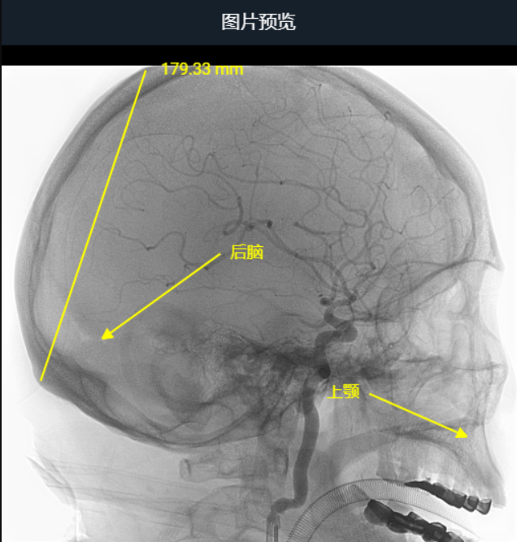

# 医学影像存档与通信系统（PACS）

#### 介绍
 **【PACS Web系统开发】全网首发-JAVA开发医学影像存档与检索系统（PACS），遵循Dicom医学影像标准** 

​​

     MiniCV系统可将医疗系统中所有的影像读取出来，同时也可作为不同医疗系统影像传递交换的工具。医疗影像储传系统可分别由X光机 (X-RAY）、核磁共振扫设备(MR)、超音波仪器(ECHO)、 计算机断层扫描设备(CT)、乳腺钼靶(MG)等不同的医疗摄影仪器中取得数据，也可手动上传文件Dicom文件而获取数据，协助医院处理传统X光片的管理，调阅、人力以及储存空间等问题，实现辅助医疗诊断的目的，并支持医生在线根据患者的影像图像编写病情诊断书。

     基于B/S架构的 Web版 Mini PACS 系统，后端采用 JAVA，利用SSM 等主流框架，前端采用 Vue2、React 框架开发，数据库采用 MySQL、Redis 。主要实现 Dicom 文件接收与传输、云胶片、CD/DVD 刻录、在线报告、数据分析等功能。目前已打通 Dicom 文件于系统中的数据流，数据文件可通过接收 Dicom 服务节点获取，也可手动上传文件，并且可将患者检查的 Dicom 文件传输至系统中动态配置的 Dicom 服务器；实现在线云胶片功能，可在线查看与操作医学影像图像等功能。

#### 主干功能

 **已开发功能** 
- RBAC用户权限管理、服务监控、字典维护、通知公告等基础模块；
- 手动上传Dicom文件/文件夹，及接收Dicom服务器的Dicom文件集功能；
- 患者检查列表展示及维护功能；
- 检查下序列影像的列表（单帧影像预览）功能；
- Dicom影像在线查看，提供测量、窗口调整、平移与缩放、图像截图、注释等工具；
- Dicom服务器动态配置功能；
- 发送Dicom集文件到其他Dicom服务器功能。

 **TODO:后续功能开发：** 
- 检查数据可视化分析
- 在线报告维护
- 影像刻录CD/DVD
- 影像胶片打印
- AI辅助阅片
- etc.

#### 演示截图

​​

